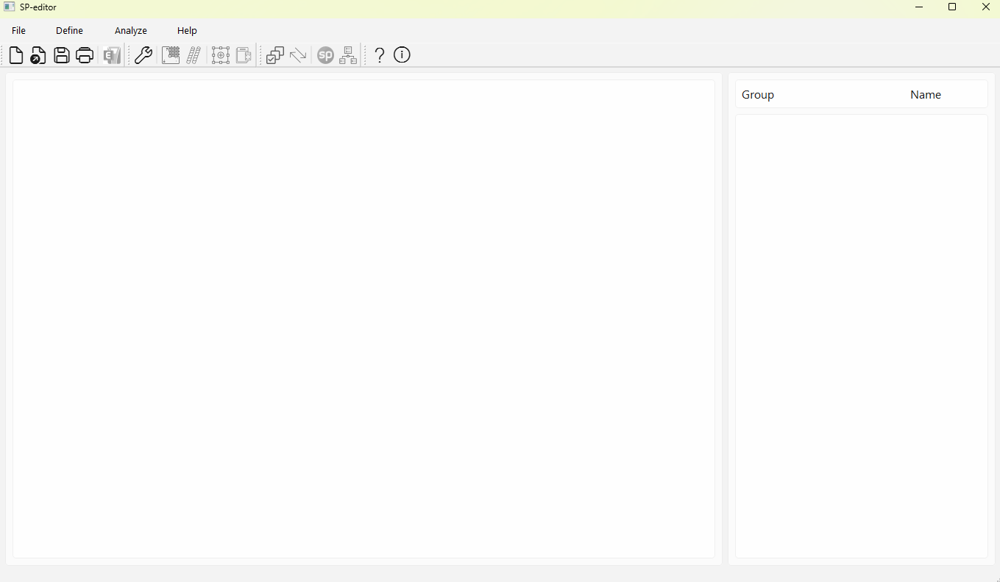

# SP-editor

Empowering Structural Engineers with Seamless Communication Between SpColumn and ETABS

## Installation

This lib is managed by [UV](/docs.astral.sh/uv/#highlights) to manage its dependency and package

Please install UV in your local machine and run the following command to make use of the ``pyproject.toml``
to install the needed development components.

```bash
uv sync
```

then start the main src/sp_editor/main.py file to run the application


If you want to add package to the project

```bash
uv add 'package name'
```
Please take a look at the uv command so we can make it through on the same procedure.
[UV documentation](/docs.astral.sh/uv/concepts/projects/)
Please create your own branch and then merge change with ``main`` branch

## What is this Software about?

Sp-editor covers the following exciting features:

* Extract wall pier geometry defined in Etabs and transform to (X, Y) coordinates
* Extract pier design forces from Etabs and convert to SpColumn format
* Get user input of reinforcement pattern
* Run Batch processing and export demand capacity ratio results and PMM chart
* Provide complete SpColumn file for detailed design at later phases(ie., 100DD or CD).

## Demonstration
We got a 2 minutes video demo here in the Youtube [link](/www.youtube.com/watch?v=ujFrALC1rHs) and user interface of the
software 
## Testing

## Documentation
